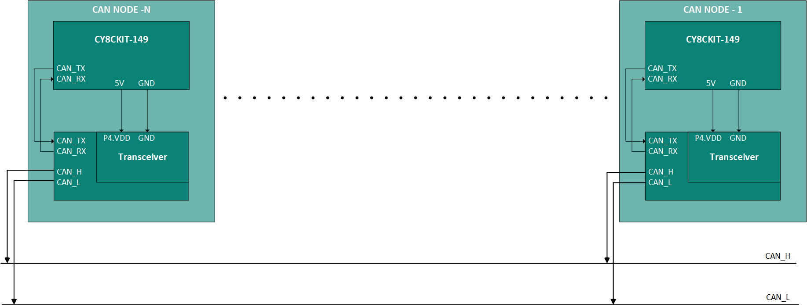
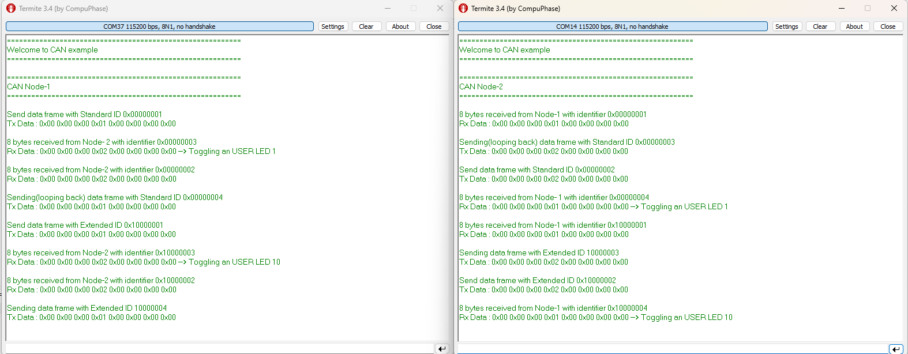
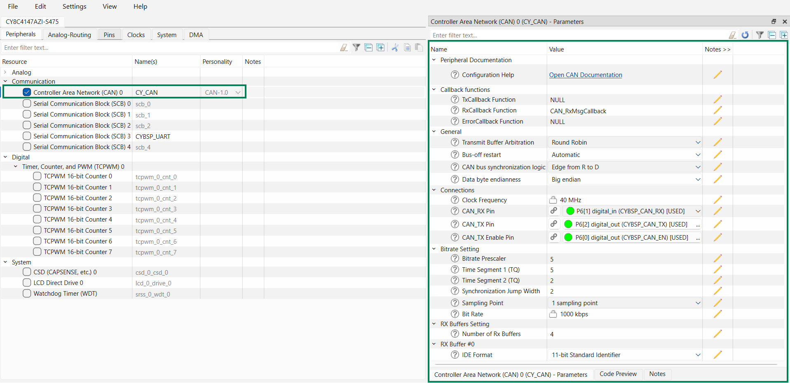
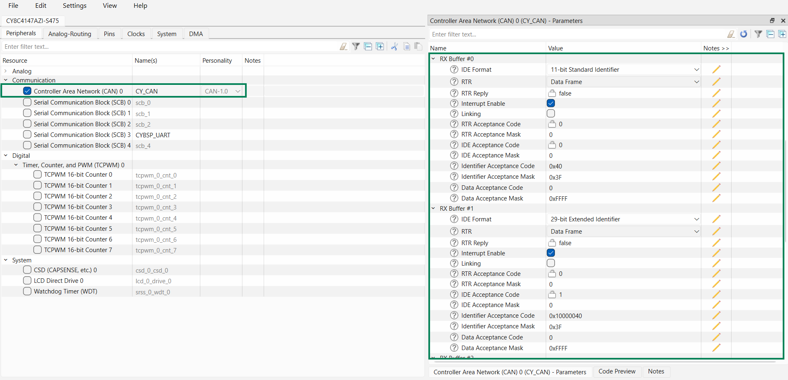
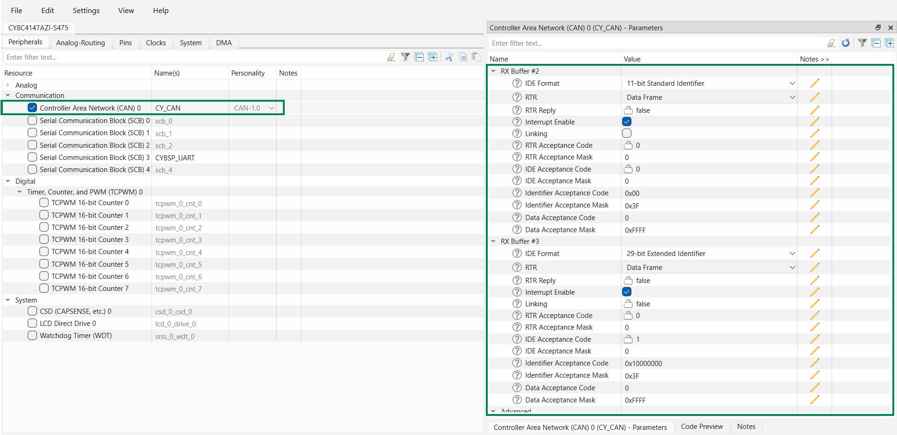

# PSOC&trade; 4100S Plus: CAN 

Controller Area Network (CAN) 2.0 is a communication protocol typically used for broadcasting sensor data and control information over two-wire connections between nodes. This example demonstrates how to use CAN 2.0 with Infineon's PSOC&trade; 4 MCU devices. 

This example requires at least two nodes, or one node and a tester (in this case, the Peak System PCAN-USB Pro is used). When the user button is pressed, the device transmits either a standard or extended CAN frame depending on how long the button is held. If the button is pressed for more than 10 ms, a standard ID frame is sent; if pressed for 2 seconds, an extended ID frame is sent.

When a received CAN frame’s ID falls within the range from 1 to the number of nodes in the network (for standard IDs), or from 26,843,5456 (0x10000000) to 26,843,5456 plus the number of nodes in the network (for extended IDs), the frame is “looped back” by adding the maximum node count to its ID and retransmitting it.

 After loop-back:
   - USER_LED1 toggles upon receiving standard-ID frames from each node in the network
   - USER_LED10 toggles upon receiving extended-ID frames from each node in the network

[View this README on GitHub.](https://github.com/Infineon/mtb-example-psoc4-can)

[Provide feedback on this code example.](https://cypress.co1.qualtrics.com/jfe/form/SV_1NTns53sK2yiljn?Q_EED=eyJVbmlxdWUgRG9jIElkIjoiQ0UyMzMxNjUiLCJTcGVjIE51bWJlciI6IjAwMi0zMzE2NSIsIkRvYyBUaXRsZSI6IkNBTiBGRCIsInJpZCI6ImtoYXRyaW5hdmluayIsIkRvYyB2ZXJzaW9uIjoiMi4wLjAiLCJEb2MgTGFuZ3VhZ2UiOiJFbmdsaXNoIiwiRG9jIERpdmlzaW9uIjoiTUNEIiwiRG9jIEJVIjoiSUNXIiwiRG9jIEZhbWlseSI6IlBTT0MifQ==)

## Requirements


- [ModusToolbox&trade; software](https://www.infineon.com/modustoolbox) v3.8 or later (tested with v3.8)
- PSOC&trade; 4 Board support package (BSP) minimum required version: 3.0.0
- Programming language: C
-- Associated parts: [PSOC&trade; 4100S Plus](https://www.infineon.com/products/microcontroller/32-bit-psoc-arm-cortex/psoc-4-mcu/4100/psoc-4100s-plus)

## Supported toolchains (make variable 'TOOLCHAIN')

- GNU Arm&reg; embedded compiler v14.2.1 (`GCC_ARM`) - Default value of `TOOLCHAIN`
- Arm&reg; compiler v6.24 (`ARM`)
- IAR C/C++ compiler v9.70.1 (`IAR`)

## Supported kits (make variable 'TARGET')

- [PSOC&trade; 4100S Plus Prototyping Kit](https://www.infineon.com/cms/en/product/evaluation-boards/cy8ckit-149/) (`CY8CKIT-149`) - Default value of `TARGET`


## Hardware setup

- This example uses the board's default configuration for `CY8CKIT-149`. See the kit user guide and schematic to ensure that the board is configured correctly

- This code example requires minimum two kits listed in the 
[Supported kits](#supported-kits-make-variable-target) section. First and second kit runs this example with change in macro 

- In addition, each kit from [Supported kits](#supported-kits-make-variable-target) requires a CY8CKIT-026 (CAN and LIN Shield) kit, which acts as the physical layer for each node 

    **Note**: Here,pin 1 & 2 of J20 of CY8CKIT-026 are shortened using jumper. See **3.6.4 Power Selection Jumper (J20) section** in [CY8CKIT-026 CAN and LIN Shield Kit Guide](https://www.infineon.com/cms/en/product/evaluation-boards/cy8ckit-026/#!?fileId=8ac78c8c7d0d8da4017d0efb313a110d) for more details.
   
  **Figure 1. CAN connections**

  

- Use jumper wires to establish a connection between CAN NODE-1, CAN NODE-2 and CAN NODE-N. See **Figure 1**


    - Connect CAN_RX(J1[10]) pin, CAN_TX(J1[9])pin and CAN_EN(J1[11]) of the development kits to the respective CY8CKIT-026's CAN_RX, CAN_TX and CAN_EN pins

    - Connect CAN2_L (J23[1]) pin of NODE-1, NODE-2, and NODE-N using jumper wires in CY8CKIT-026

    - Connect CAN2_H (J23[2]) pin of NODE-1  NODE-2, and NODE-N using jumper wires in CY8CKIT-026

    - In both CY8CKIT-026 kits, connect J1[7] to 5 V to power CAN2 transceiver

See **Table 1** of supported kits for the pin assignments for NODE-1, NODE-2, and NODE-N.

**Table 1. Pin connections between the supported development kit and CY8CKIT-026 kit for each node**

Kit | CAN_EN | CAN_RX | CAN_TX | Ground | Power to CAN2 transceiver
---|---|---|---|--|---- 
CY8CKIT-149 | 6[0] | 6[1] | 6[2] | GND | J10[30] (V5.0) 
CY8CKIT-026 | J9[1] | J9[3] | J9[2] | GND | J1[7] (P4.VDD)
<br>

   > **Note:** To operate this code example on CY8CKIT-149 Kit, remove 0 ohm resistor: R29,R30, and R31.

## Software setup

Install a terminal emulator if you don't have one. Instructions in this document use [Tera Term](https://teratermproject.github.io/index-en.html).


## Using the code example

Create the project and open it using one of the following:

<details><summary><b>In Eclipse IDE for ModusToolbox&trade; software</b></summary>

1. Click the **New Application** link in the **Quick Panel** (or, use **File** > **New** > **ModusToolbox&trade; Application**). This launches the [Project Creator](https://www.infineon.com/ModusToolboxProjectCreator) tool

2. Pick a kit supported by the code example from the list shown in the **Project Creator - Choose Board Support Package (BSP)** dialog

   When you select a supported kit, the example is reconfigured automatically to work with the kit. To work with a different supported kit later, use the [Library Manager](https://www.infineon.com/ModusToolboxLibraryManager) to choose the BSP for the supported kit. You can use the Library Manager to select or update the BSP and firmware libraries used in this application. To access the Library Manager, click the link from the **Quick Panel**

   You can also just start the application creation process again and select a different kit

   If you want to use the application for a kit not listed here, you may need to update the source files. If the kit does not have the required resources, the application may not work

3. In the **Project Creator - Select Application** dialog, choose the example by enabling the checkbox

4. (Optional) Change the suggested **New Application Name**

5. The **Application(s) Root Path** defaults to the Eclipse workspace which is usually the desired location for the application. If you want to store the application in a different location, you can change the *Application(s) Root Path* value. Applications that share libraries should be in the same root path

6. Click **Create** to complete the application creation process

For more details, see the [Eclipse IDE for ModusToolbox&trade; software user guide](https://www.infineon.com/MTBEclipseIDEUserGuide) (locally available at *{ModusToolbox&trade; software install directory}/docs_{version}/mt_ide_user_guide.pdf*).

</details>

<details><summary><b>In command-line interface (CLI)</b></summary>

ModusToolbox&trade; software provides the Project Creator as both a GUI tool and the command line tool, "project-creator-cli". The CLI tool can be used to create applications from a CLI terminal or from within batch files or shell scripts. This tool is available in the *{ModusToolbox&trade; software install directory}/tools_{version}/project-creator/* directory.

Use a CLI terminal to invoke the "project-creator-cli" tool. On Windows, use the command line "modus-shell" program provided in the ModusToolbox&trade; software installation instead of a standard Windows command-line application. This shell provides access to all ModusToolbox&trade; software tools. You can access it by typing `modus-shell` in the search box in the Windows menu. In Linux and macOS, you can use any terminal application.

The "project-creator-cli" tool has the following arguments:

Argument | Description | Required/optional
---------|-------------|-----------
`--board-id` | Defined in the `<id>` field of the [BSP](https://github.com/Infineon?q=bsp-manifest&type=&language=&sort=) manifest | Required
`--app-id`   | Defined in the `<id>` field of the [CE](https://github.com/Infineon?q=ce-manifest&type=&language=&sort=) manifest | Required
`--target-dir`| Specify the directory in which the application is to be created if you prefer not to use the default current working directory | Optional
`--user-app-name`| Specify the name of the application if you prefer to have a name other than the example's default name | Optional

<br />

The following example clones the "[mtb-example-psoc4-can](https://github.com/Infineon/mtb-example-psoc4-can)" application with the desired name "MyCAN" configured for the *CY8CKIT*-*149* BSP into the specified working directory, *C:/mtb_projects*:

   ```
   project-creator-cli --board-id CY8CKIT-149 --app-id mtb-example-psoc4-can --user-app-name MyCAN2_0 --target-dir "C:/mtb_projects"
   ```

**Note:** The project-creator-cli tool uses the `git clone` and `make getlibs` commands to fetch the repository and import the required libraries. For details, see the "Project creator tools" section of the [ModusToolbox&trade; software user guide](https://www.infineon.com/ModusToolboxUserGuide) (locally available at *{ModusToolbox&trade; software install directory}/docs_{version}/mtb_user_guide.pdf*).

To work with a different supported kit later, use the [Library Manager](https://www.infineon.com/ModusToolboxLibraryManager) to choose the BSP for the supported kit. You can invoke the Library Manager GUI tool from the terminal using `make library-manager` command or use the Library Manager CLI tool "library-manager-cli" to change the BSP.

The "library-manager-cli" tool has the following arguments:

Argument | Description | Required/optional
---------|-------------|-----------
`--add-bsp-name` | Name of the BSP that should be added to the application | Required
`--set-active-bsp` | Name of the BSP that should be as active BSP for the application | Required
`--add-bsp-version`| Specify the version of the BSP that should be added to the application if you do not wish to use the latest from manifest | Optional
`--add-bsp-location`| Specify the location of the BSP (local/shared) if you prefer to add the BSP in a shared path | Optional

<br />

Following example adds the CY8CKIT-149 BSP to the already created application and makes it the active BSP for the app:

   ```
   library-manager-cli --project "C:/mtb_projects/MyCAN2_0" --add-bsp-name CY8CKIT-149 --add-bsp-version "latest-v3.X" --add-bsp-location "local"

   library-manager-cli --project "C:/mtb_projects/MyCAN2_0" --set-active-bsp APP_CY8CKIT-149
   ```

</details>

<details><summary><b>In third-party IDEs</b></summary>

Use one of the following options:

- **Use the standalone [Project Creator](https://www.infineon.com/ModusToolboxProjectCreator) tool:**

   1. Launch Project Creator from the Windows Start menu or from *{ModusToolbox&trade; software install directory}/tools_{version}/project-creator/project-creator.exe*

   2. In the initial **Choose Board Support Package** screen, select the BSP, and click **Next**

   3. In the **Select Application** screen, select the appropriate IDE from the **Target IDE** drop-down menu

   4. Click **Create** and follow the instructions printed in the bottom pane to import or open the exported project in the respective IDE

<br />

- **Use command-line interface (CLI):**

   1. Follow the instructions from the **In command-line interface (CLI)** section to create the application

   2. Export the application to a supported IDE using the `make <ide>` command

   3. Follow the instructions displayed in the terminal to create or import the application as an IDE project

For a list of supported IDEs and more details, see the "Exporting to IDEs" section of the [ModusToolbox&trade; software user guide](https://www.infineon.com/ModusToolboxUserGuide) (locally available at *{ModusToolbox&trade; software install directory}/docs_{version}/mtb_user_guide.pdf*).

</details>


## Operation

1. Connect the CAN and ground pins of the development kit using the instructions in the [Hardware setup](#hardware-setup) section

2. Connect the CAN NODE-1 development kit to your PC using the provided USB cable through the KitProg3 USB connector to program the device

3. Program the board using one of the following:

   <details><summary><b>Using Eclipse IDE for ModusToolbox&trade; software</b></summary>

      1. Select the application project in the Project Explorer

      2. In the **Quick Panel**, scroll down, and click **\<Application Name> Program (KitProg3_MiniProg4)**
   </details>

   <details><summary><b>Using CLI</b></summary>

     From the terminal, execute the `make program` command to build and program the application using the default toolchain to the default target. The default toolchain is specified in the application's Makefile but you can override this value manually:
      ```
      make program TOOLCHAIN=<toolchain>
      ```

      Example:
      ```
      make program TOOLCHAIN=GCC_ARM
      ```
   </details>

4. Connect the other CAN NODE kit to your PC using the provided USB cable through the KitProg3 USB connector and follow **Step 3**

5. Open a terminal program and select the KitProg3 COM port. Set the serial port parameters to 8N1 and 115200 baud

6. Press **USER SW1 (3.7)** for 10 ms on any node in the network to transmit a standard ID frame from that node to the other node(s). Press **USER SW1 (3.7)** for 2 seconds on any node to transmit an extended ID frame from that node to the other node(s)

7. When this frame is received by another node, all nodes loop back the frame by adding the total number of nodes in the network to the received ID

8. After loop-back, if a frame with an ID equal to the sent ID plus the number of nodes is received from all other nodes in the network, **USER LED1 (3.4)** will toggle for a standard ID, and **USER LED10 (2.2)** will toggle for an extended ID. Observe the results in the terminal window for both nodes by opening another instance of the terminal. **Figure 2** shows print logs from both nodes (assuming there are two nodes in the network)

   **Figure 2. Terminal output for both the NODES**

   


## Debugging

You can debug the example to step through the code. In the IDE, use the **\<Application Name> Debug (KitProg3_MiniProg4)** configuration in the **Quick Panel**. For details, see the "Program and debug" section in the [Eclipse IDE for ModusToolbox&trade; software user guide](https://www.infineon.com/dgdl/Infineon-Eclipse_IDE_for_ModusToolbox_User_Guide_1-UserManual-v01_00-EN.pdf?fileId=8ac78c8c7d718a49017d99bcb86331e8).

> **Note: (Only while debugging)** On the CM4 CPU, some code in `main()` may execute before the debugger halts at the beginning of `main()`. This means that some code executes twice – once before the debugger stops execution, and again after the debugger resets the program counter to the beginning of `main()`. See [KBA231071](https://community.infineon.com/docs/DOC-21143) to learn about this and for the workaround.


## Design and implementation

Controller Area Network (CAN) is a serial communications protocol designed to enable reliable and efficient communication over two-wire interconnections between electronic control units (ECUs) in various applications, including automotive and industrial devices. It provides a high level of security through error detection and correction mechanisms.

The provided code example demonstrates a customized setup for the CAN block. Here’s a simplified breakdown of how it works:  
When the user button is pressed on any node, the duration of the press determines the type of CAN frame sent to the other node(s):<br />
-  If the button is pressed and held for 10 ms, a data frame with a standard identifier equal to the node number is sent
- If the button is pressed and held for 2 seconds, a data frame with an extended identifier equal to the node number plus 0x10000000 is sent

The receiving nodes responds to these frames in the following way:
1. **Standard ID Frame Reception (ID = NODE NUMBER ):** 
      -  When a receiving node gets a data frame, it loops back the frame by updating the ID,adding number of nodes count in network     
   
2. **Remote Request Frame Reception (ID = NODE NUMBER + 0x10000000):**
      - When a receiving node gets a data frame with an extended identifier, it loops back the frame by updating the ID, adding number of nodes count in network  

When the sending node, which initiated the transmission request for a data frame with a standard or extended ID, receives the looped-back frame from all other nodes, it performs the following actions:

- It toggles **USER LED1(3.4)** for standard ID frame
- It toggles **USER LED10(2.2)** for extended ID frame

All the CAN NODEs log the status over UART serial terminal. 

### CAN frame format
ID   - CAN FD identifier;
DLC  - Data length code;
Data - Actual data bytes

 ID  | DLC | Data 
------|------------|------
 0x22 | 0x08 | 0x01 0x02 0x03 0x04 0x05 0x06 0x07 0x08


### Resources and settings
Figure 3. highlights the CAN Configuration and Parameter setting.
<br>
   **Figure 3. CAN Configuration**

   
   
   <br>
   
**Table 2. Application resources**
 Resource  |  Alias/object     |    Purpose
 :------- | :------------    | :------------
 CAN (PDL) |can_HW  | To generate CAN frames

<br>

## Related resources


Resources  | Links
-----------|----------------------------------
Application notes  |[AN79953](https://www.infineon.com/AN79953) – Getting started with PSOC&trade; 4 <br />  [AN85951](https://www.infineon.com/AN85951) – PSOC&trade; 4 design guide
Code examples  | [Using ModusToolbox&trade;](https://github.com/Infineon/Code-Examples-for-ModusToolbox-Software) on GitHub
Development kits | Select your kits from the [evaluation board finder](https://www.infineon.com/cms/en/design-support/finder-selection-tools/product-finder/evaluation-board) page
Libraries on GitHub  | [retarget-io](https://github.com/Infineon/retarget-io) – Utility library to retarget STDIO messages to a UART port <br>  [mtb-pdl-cat2](https://github.com/Infineon/mtb-pdl-cat2) – PSOC&trade; 4 peripheral driver library (PDL) <br>  [mtb-hal-cat2](https://github.com/Infineon/mtb-hal-cat2) – Hardware abstraction layer (HAL) library
Middleware on GitHub  | [capsense](https://github.com/Infineon/capsense) – CAPSENSE&trade; library and documents <br>
Tools  | [Eclipse IDE for ModusToolbox&trade; software](https://www.infineon.com/cms/en/design-support/tools/sdk/modustoolbox-software) – ModusToolbox&trade; software is a collection of easy-to-use software and tools enabling rapid development with Infineon MCUs, covering applications from embedded sense and control to wireless and cloud-connected systems using AIROC&trade; Wi-Fi and Bluetooth® connectivity devices. <br> [PSOC&trade; Creator](https://www.infineon.com/cms/en/design-support/tools/sdk/psoc-software/psoc-creator) – IDE for PSoC&trade; and FM0+ MCU development

<br />

## Other resources

Infineon provides a wealth of data at [www.infineon.com](https://www.infineon.com) to help you select the right device, and quickly and effectively integrate it into your design.


## Document history

Document title: *CE243196* - *PSOC&trade; 4100S Plus: CAN*

 Version | Description of change
 ------- | ---------------------
 1.0.0   | New code example

<br />

---------------------------------------------------------

All referenced product or service names and trademarks are the property of their respective owners.

The Bluetooth&reg; word mark and logos are registered trademarks owned by Bluetooth SIG, Inc., and any use of such marks by Infineon is under license.

PSOC&trade;, formerly known as PSoC&trade;, is a trademark of Infineon Technologies. Any references to PSoC&trade; in this document or others shall be deemed to refer to PSOC&trade;.

---------------------------------------------------------

(c) 2026, Infineon Technologies AG, or an affiliate of Infineon Technologies AG. All rights reserved.
This software, associated documentation and materials ("Software") is owned by Infineon Technologies AG or one of its affiliates ("Infineon") and is protected by and subject to worldwide patent protection, worldwide copyright laws, and international treaty provisions. Therefore, you may use this Software only as provided in the license agreement accompanying the software package from which you obtained this Software. If no license agreement applies, then any use, reproduction, modification, translation, or compilation of this Software is prohibited without the express written permission of Infineon.
<br>
Disclaimer: UNLESS OTHERWISE EXPRESSLY AGREED WITH INFINEON, THIS SOFTWARE IS PROVIDED AS-IS, WITH NO WARRANTY OF ANY KIND, EXPRESS OR IMPLIED, INCLUDING, BUT NOT LIMITED TO, ALL WARRANTIES OF NON-INFRINGEMENT OF THIRD-PARTY RIGHTS AND IMPLIED WARRANTIES SUCH AS WARRANTIES OF FITNESS FOR A SPECIFIC USE/PURPOSE OR MERCHANTABILITY. Infineon reserves the right to make changes to the Software without notice. You are responsible for properly designing, programming, and testing the functionality and safety of your intended application of the Software, as well as complying with any legal requirements related to its use. Infineon does not guarantee that the Software will be free from intrusion, data theft or loss, or other breaches (“Security Breaches”), and Infineon shall have no liability arising out of any Security Breaches. Unless otherwise explicitly approved by Infineon, the Software may not be used in any application where a failure of the Product or any consequences of the use thereof can reasonably be expected to result in personal injury.

